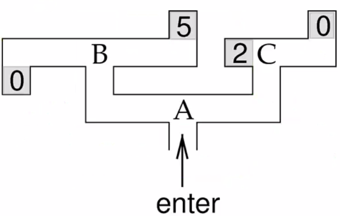

## 1. 

Which of the following is true of unsupervised and supervised learning during training of a network? (check all that apply)

In unsupervised learning, correct outputs are provided to the network
In unsupervised learning, inputs are provided to the network
In supervised learning, inputs are provided to the network
In supervised learning, correct outputs are provided to the network

Answer:

In unsupervised learning, inputs are provided to the network
In supervised learning, inputs are provided to the network
In supervised learning, correct outputs are provided to the network

## 2.

Recall the perceptron, which classifies inputs as belonging to one of two categories, and correspondingly outputs either +1 or -1. Consider a perceptron that receives two inputs u1 and u2 with synaptic weights 1 and 3 respectively. If the threshold μ for the perceptron is 0, which of the following inputs [u1 u2] will lead to a positive output from perceptron? (check all that apply)

[-1 1]
[1 1]
[-1 -1]
[1 -1]

Answer:
[-1 1]
[1 1]

## 3.

Suppose a perceptron receiving 5 inputs is being trained to categorize input patterns u (a 5-element vector consisting of either +1 or -1 for each of the inputs) into one of two categories. The perceptron generates an output v (+1 or -1) corresponding to its categorization of the input pattern. Synaptic weights wi are given in vector w. Now suppose that the perceptron has incorrectly classified the most recent input pattern [+1 -1 -1 +1 -1], outputting +1 when it should have given -1. According to the perceptron learning rule, which of the following adjustments should be made? (check all that apply)

The threshold should increase
The threshold should decrease
w_3 should decrease
w_3 should increase

Answer:
The threshold should increase
w_3 should increase

## 4.

Learning with perceptrons appears similar to many other methods we learned - we take a delta between the known output and our predicted output and use that to determine the direction and scale of our adjustments to the model. Likewise with our multilayer sigmoid networks, we once again used gradient descent to learn parameters.

Typically we can have a single data set over which we loop multiple times, using each data point in the set to train the perceptron until its weight values appear to converge to something. One issue with this type of learning is that with a fixed positive learning rate, the method can result in oscillations around the ideal estimate and never quite converge. In other words, it will bounce around the value we are looking for without ever falling within some stopping criteria (for instance, that the parameters stop changing much). As a result, we might be stuck training forever!

What can we change to guarantee this doesn't happen?

We cannot guarantee it
In each pass through the dataset, divide the learning rate by a value greater than 1
Randomize the order of the training data each time we loop over it
Get more training data

Answer:
In each pass through the dataset, divide the learning rate by a value greater than 1

## 5.

We have now talked explicitly about three types of learning: unsupervised, supervised, and reinforcement learning. Which is most appropriate depends on the structure of your problem and the data available. For the following three questions, pick the type of learning that is most appropriate for the problem:

We are teaching an AI agent to play chess, but we do not have an expert around to show us the value of individual moves. The only feedback we get is at the end of the game when we discover that we have won or lost.

Reinforcement
Unsupervised
Supervised

Answer:
Reinforcement

## 6.

Pick the type of learning that is most appropriate for the problem:

We have a robot which can perceive and manipulate objects in the environment, but does not have a sense for how to manipulate them skillfully (e.g., to avoid breaking the objects). Let us say we asked the robot to pour us a cup of milk. Whenever it broke something or did something unrelated to the task, we said "bad robot." And when it made some good progress we said "good robot." Periodically, we would say "hurry up" to get it to work faster. After it accomplishes its task, we would plug it into the wall to show our appreciation.

Reinforcement
Unsupervised
Supervised

Answer:
Reinforcement

## 7.

Pick the type of learning that is most appropriate for the problem:

We have a disease outbreak, and we have no idea what caused it. The only information we have is where each reported case is located on the map. We want to calculate where the largest focii of outbreaks are so we can go there to investigate.

Reinforcement
Unsupervised
Supervised

Answer:
Unsupervised

## 8.

Pick the type of learning that is most appropriate for the problem:

Suppose we have a collection of images of cars. All of the images are ~1 million pixels. Let us say we were trying to model a neuron whose job it was to find the dominant color in an image (e.g., that the car was red). Since 1 million pixels makes the learning problem a very large one, we want to reduce each image to a simple set of features - some simple measure of the overall color balance in each image, with the possibility of, for instance, weighting the pixels in the center of the image more than those near the outside. What type of learning would we use to discover these features?

Reinforcement
Unsupervised
Supervised

Answer:
Unsupervised

## 9.

Pick the type of learning that is most appropriate for the problem:

Let us say there is a disease outbreak, and for every case, we have the complete medical history of the patient. Suppose we think the disease has some correlation with the amount of soda the patient drank every day. If we have good soda consumption information for every patient, and some generalized consumption information for the greater society, what type of learning would help us estimate the connection between soda consumption and the disease?

Reinforcement
Unsupervised
Supervised

Answer:
Unsupervised,x
Supervised

## 10.

Pick the type of learning that is most appropriate for the problem:

Suppose we have a collection of images of cars, which somebody has conveniently labelled as "red car," "blue car," etc. What type of learning would help us build a system which can later make the labels for us for new car images?

Reinforcement
Unsupervised
Supervised

Answer:
Supervised

## 11.
Going back to the maze from the lectures, let's add a crazy twist to our randomized policy. Suppose that after arriving at B, the rat is immediately teleported to C 20% of the time and the rest of the time, the action selected by the uniformly random policy is executed at B.

What would the new values for B and C be?

v(B)=2.2;v(C)=1

v(B)=2.25;v(C)=1.25

v(B)=2.2;v(C)=1.3

None of these

Answer:
v(B)=2.2;v(C)=1

## 12.

Let's look at a twist on the same maze, but without the teleportation. First, let's define a new function called R, which stands for 'reward.' The reward function is defined as: R(u,a)→ℝ, which means that if we are in a given state, and take a particular action, we will be granted a certain real-numbered reward. Notice that this differs only slightly from what we were doing in the lecture, where the states were locations on the maze, and rewards were associated only with the four final states (the grey boxes). In that case, rewards were not tied to the actions themselves, only to the resulting states.

The reason we may want to extend the reward function in this way is that it allows us to do more interesting things. Let us say that we divide this maze up into a grid, where each grid cell is a state. Now A, B, and C are still states, as are the four final states, but we have numerous states in between them. Our set of actions allows us to move one state at a time, and backtrack as many times as we want. The rat can also choose to stop and rest. Given this revised model, let us say that we wanted to give a penalty proportional to the amount of time taken to reach a final state. Check each of the following that would allow us to accomplish this:

Set R equal to some negative constant r_{penalty} for all states and actions excluding the final states, which will remain as they are marked in the maze for all actions.

Subtract some amount from each final state proportional to its distance from the maze entrance.

Set a penalty at B and C proportional to the sum of their distance from A and the neighboring final states.

Using a reward function defined over only states, set R equal to some negative constant r_{penalty} for all states, excluding the final states, which will remain as they are marked presently.

Answer:
dont know

Suppose that the rat can stop to rest at any location at any time and we wanted to penalize the rat for distance traveled instead of time taken. Which reward function(s) from the following would accomplish this?

Using a reward function defined over only states, set R equal to some negative constant r_{penalty} for all states, excluding the final states, which will remain as they are marked presently.

Set a penalty at B and C proportional to the sum of their distance from A and the neighboring final states.

Subtract some amount from each final state proportional to its distance from the maze entrance.

Set R equal to some negative constant r_{penalty} for all states and all actions excluding resting, which will have a 0 reward. The final states will remain as they are marked in the maze for all actions.

Answer:
Set R equal to some negative constant r_{penalty} for all states and all actions excluding resting, which will have a 0 reward. The final states will remain as they are marked in the maze for all actions.